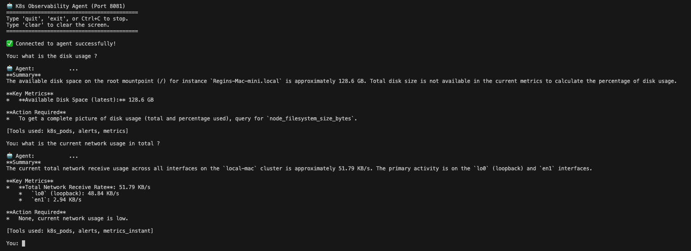
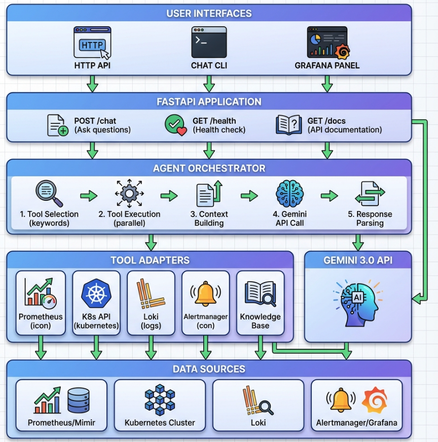
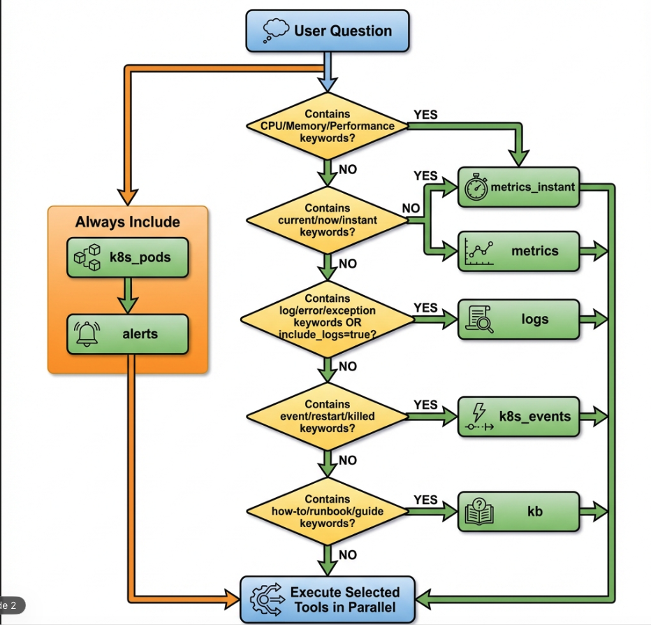
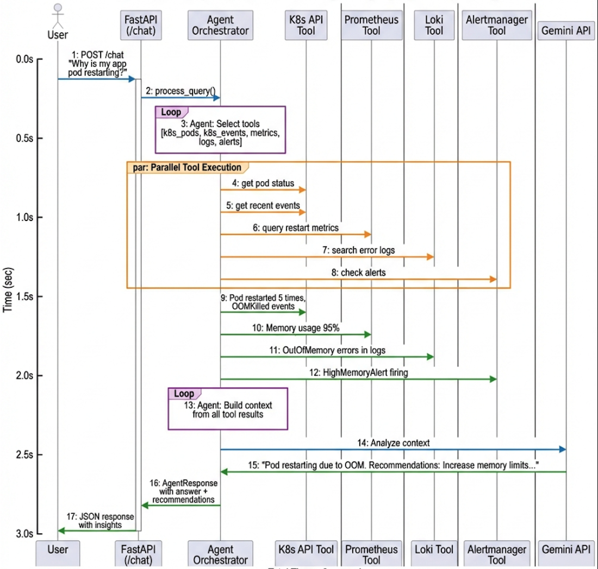

# K8s Observability AI Agent

A Kubernetes-aware observability AI agent that uses Gemini 2.5 flash to provide intelligent insights into system health, incidents, and performance issues.

## 🚀 Quick Start
## Demo



**Step 1: Validate Your Environment**
Ensure all required services (Prometheus, Loki, etc.) are running and accessible:
```bash
./scripts/validate.sh
```

**Step 2: Start the Agent**
```bash
./start.sh
```

**Step 3: Ask Questions**
```bash
python scripts/chat.py
```

**📖 For complete setup, configuration, and usage instructions, see [USER_GUIDE.md](./docs/USER_GUIDE.md)**

---



## Overview

This agent sits on top of your observability platform (Prometheus, Loki, Alertmanager, Grafana, Kubernetes API) and uses a large language model (Gemini 2.5 flash) as the reasoning engine to answer natural-language questions about your system.

### Key Features

- 🤖 **AI-Powered Analysis**: Uses Gemini 2.5 flash to interpret observability data and provide actionable insights
- 📊 **Enhanced Metrics Support**: Comprehensive querying for CPU, Memory, Disk, Network, Processes, and System metrics
- ✅ **Service Validation**: Built-in tools (`validate_services.py`) to ensure your observability stack is healthy
- ⚡ **Concise SRE Responses**: Delivers short, actionable summaries focused on key metrics and next steps
- 🔍 **Multi-Source Integration**: Queries Prometheus, Kubernetes API, Loki, and Alertmanager
- 🎯 **Context-Aware**: Understands Kubernetes-specific concepts (pods, namespaces, events, etc.)


## Architecture

```
┌─────────────────────────────────────────────────────────────┐
│                     User Interfaces                          │
│  (Grafana Panel, Slack Bot, CLI, Web UI)                    │
└─────────────────────┬───────────────────────────────────────┘
                      │
                      │ HTTP API
                      ▼
┌─────────────────────────────────────────────────────────────┐
│              K8s Observability Agent (FastAPI)               │
│                                                               │
│  ┌─────────────────────────────────────────────────────┐   │
│  │           Agent Orchestrator                         │   │
│  │  - Tool Selection                                    │   │
│  │  - Context Building                                  │   │
│  │  - Gemini Integration                                │   │
│  └─────────────────────────────────────────────────────┘   │
│                                                               │
│  ┌─────────────────────────────────────────────────────┐   │
│  │              Tool Adapters                           │   │
│  │  - Prometheus (metrics)                              │   │
│  │  - Kubernetes API (pods, events, nodes)              │   │
│  │  - Loki (logs)                                       │   │
│  │  - Alertmanager (alerts)                             │   │
│  └─────────────────────────────────────────────────────┘   │
└─────────────────────┬───────────────────────────────────────┘
                      │
                      ▼
┌─────────────────────────────────────────────────────────────┐
│              Observability Platform                          │
│  - Prometheus/Mimir (metrics)                                │
│  - Loki (logs)                                               │
│  - Alertmanager/Grafana (alerts)                             │
│  - Kubernetes API                                            │
└─────────────────────────────────────────────────────────────┘
```



## Project Structure

```
k8s-observability-agent/
├── app/                          # Core Application Package
│   ├── main.py                  # FastAPI application entry point
│   ├── agent.py                 # Agent orchestrator + Gemini integration
│   ├── config.py                # Configuration & K8s client initialization
│   ├── models.py                # Pydantic models for API
│   ├── prompts.py               # AI prompts (system, scenarios, queries)
│   └── tools/                   # Tool adapters
├── scripts/                      # Utility Scripts
│   ├── validate.sh              # Quick validation wrapper
│   ├── validate_services.py     # Comprehensive service health checker
│   ├── fix_connections.py       # Port-forward helper
│   └── chat.py                  # Interactive CLI client
├── deploy/                       # Deployment Configurations
│   ├── kubernetes.yaml          # K8s manifests
│   ├── prometheus.yml           # Standard Prometheus config
│   ├── loki.yml                 # Standard Loki config
│   └── grafana.yml              # Grafana provisioning config
├── docs/                         # Documentation
│   ├── USER_GUIDE.md            # Complete user guide
│   ├── PROJECT_STRUCTURE.md     # Detailed structure guide
│   └── VALIDATION_SYSTEM.md     # Validation system docs
├── tests/                        # Test Suite
│   ├── test_enhanced_metrics.py # Metrics coverage tests
│   └── test_agent.py            # Agent unit tests
├── .env.example                  # Environment template
├── Dockerfile                    # Container image
├── requirements.txt              # Python dependencies
└── start.sh                      # Quick start script
```




## Installation & Setup

1. **Clone the repository**:
   ```bash
   git clone https://github.com/ReginRavi/Agent_k8s_observability.git
   cd Agent_k8s_observability
   ```


2. **Install Dependencies**:
   ```bash
   python3 -m venv venv
   source venv/bin/activate
   pip install -r requirements.txt
   ```

3. **Verify Services**:
   ```bash
   ./scripts/validate.sh
   ```

4. **Run the Agent**:
   ```bash
   ./start.sh
   ```

## Configuration

The agent is configured via environment variables in `.env`.

### Observability Endpoints
- `PROMETHEUS_URL`: Default `http://localhost:19090`
- `LOKI_URL`: Default `http://localhost:3100`
- `ALERTMANAGER_URL`: Default `http://localhost:9093`
- `GRAFANA_URL`: Default `http://localhost:3000`

### Deployment Configs
Standard configuration files are provided in `deploy/` for setting up your stack:
- `deploy/prometheus.yml`
- `deploy/loki.yml`
- `deploy/grafana.yml`

## Usage Examples

### Interactive Chat
```bash
python scripts/chat.py
```

### Example Queries

**System Metrics:**
- "What is the CPU idle rate?"
- "Show me memory usage percentage"
- "What is the disk write speed?"
- "Show me network traffic"
- "How many processes are running?"

**Troubleshooting:**
- "Why is the api-service pod restarting?"
- "Are there any alerts firing?"
- "Show me recent errors in the application logs"

## API Usage

**POST /chat**
```bash
curl -X POST http://localhost:8081/chat \
  -H "Content-Type: application/json" \
  -d '{
    "question": "What is the CPU usage?",
    "context": {}
  }'
```

## Contributing

1. Fork the repository
2. Create a feature branch
3. Make your changes
4. Submit a pull request

## License

MIT License
